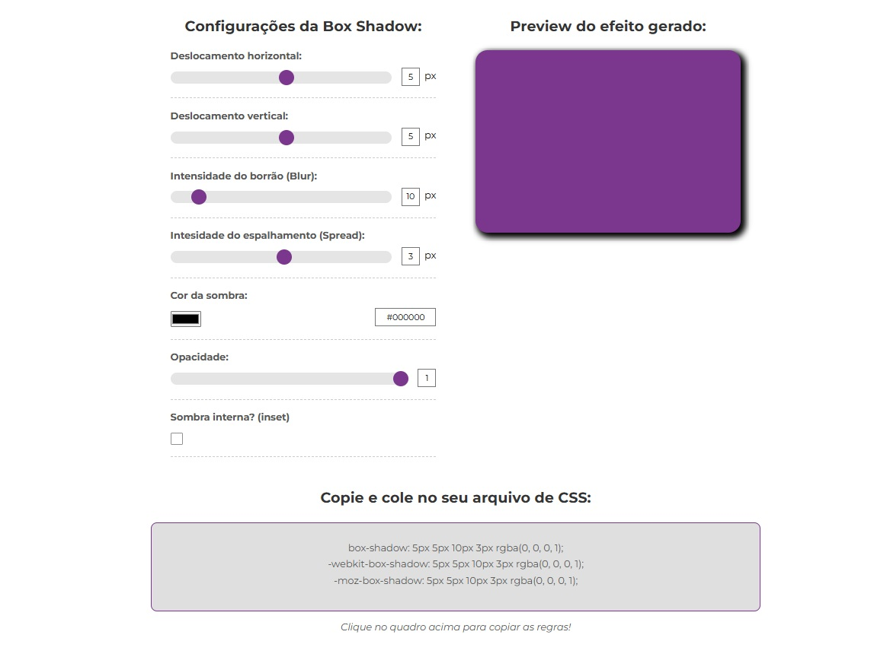

# 🎨 Box Shadow Generator

## 📚 Sobre o Projeto

Box Shadow Generator é uma ferramenta web interativa para criar, visualizar e copiar facilmente sombras CSS personalizadas. Ideal para desenvolvedores e designers que desejam experimentar diferentes configurações de box-shadow e obter o código pronto para uso em seus projetos. Com interface moderna, responsiva e intuitiva, o projeto facilita a prototipagem visual e acelera o fluxo de trabalho front-end.

## ✨ Funcionalidades

- 🎚️ **Ajuste Dinâmico dos Parâmetros**
  - Modifique deslocamento horizontal, vertical, blur, spread, cor, opacidade e tipo (inset) em tempo real
- 👀 **Preview Instantâneo**
  - Visualize o efeito da sombra aplicada em um box de demonstração
- 📋 **Cópia Rápida do Código**
  - Copie o código CSS gerado com um clique para usar direto no seu projeto
- 🖍️ **Seleção de Cor**
  - Escolha a cor da sombra com o seletor integrado
- 🧩 **Compatibilidade Cross-Browser**
  - Gera regras para box-shadow padrão, -webkit- e -moz-
- 📱 **Design Responsivo**
  - Interface adaptável para desktop e mobile
- 🏷️ **Interface Moderna**
  - Utilização de Google Fonts e layout clean

## 🛠️ Tecnologias

- 
- 
- 
- 

## 🚀 Como Usar

- **1.Clone o repositório:**

  ```bash
    git clone https://github.com/seu-usuario/box-shadow-generator.git
  ```

- **2.Abra o projeto:**

  ```bash
    cd box-shadow-generator
    code . # Para abrir no VS Code
  ```

- **3.Execute o aplicativo:**

  - Abra o `index.html` em seu navegador;
  - Ou utilize a extensão Live Server no VS Code.

## 📁 Estrutura do Projeto

```plaintext
box-shadow-generator/

├── [index.html]
├── [README.md]
└── src/
  ├── css/
  │ └── [style.css]
  └── js/
    ├── [script.js]
    ├── [boxShadowGenerator.js]
    └── [domUtils.js]
```

- **index.html:** Estrutura principal da aplicação;
- **src/css/style.css:** Estilos customizados e responsivos;
- **src/js/boxShadowGenerator.js:** Classe responsável pela geração e atualização da box-shadow;
- **src/js/domUtils.js:** Utilitários para manipulação do DOM e eventos;
- **src/js/script.js:** Lógica principal da aplicação.

## 🔍 Principais Recursos do Código

```javascript
// Exemplo: Atualização dinâmica dos valores e preview

export function bindInput(refs, boxShadow) {
  refs.forEach(({ input, type }) => {
    input.addEventListener("input", () => {
      const value = input.type === "checkbox" ? input.checked : input.value;
      boxShadow.updateValue(type, value);
    });
  });
}
```

## 📸 Preview



## 🤝 Contribuindo

1. **Faça um Fork do projeto**
2. **Crie sua Feature Branch (git checkout -b feature/Minhafeature)**
3. **Commit suas mudanças (git commit -m 'feat: adicionar nova feature')**
4. **Push para a Branch (git push origin feature/MinhaFeature)**
5. **Abra um Pull Request**

---

## Status do Projeto


---

⌨️ Desenvolvido por João Paulo Araújo

[](https://linkedin.com/in/joaofonsecaraujo)
